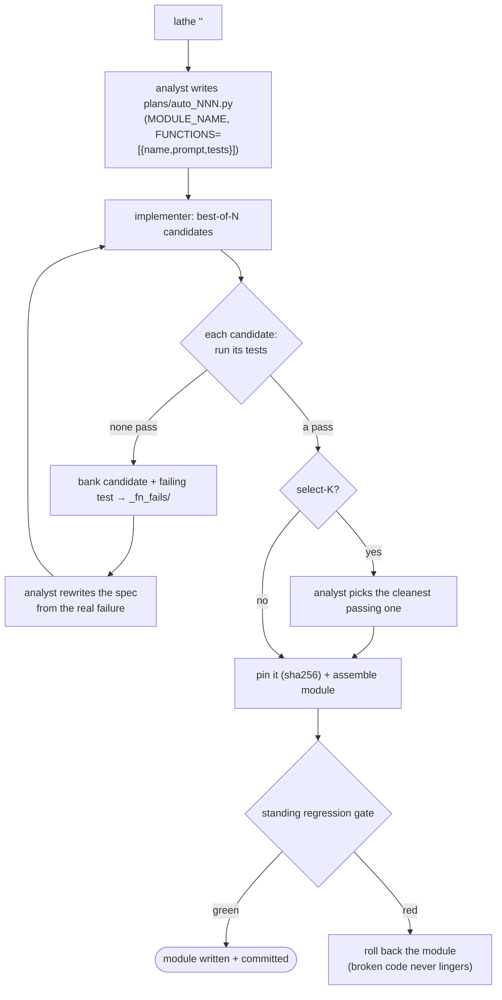
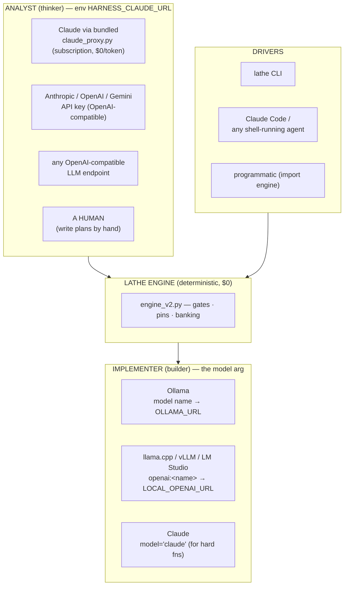
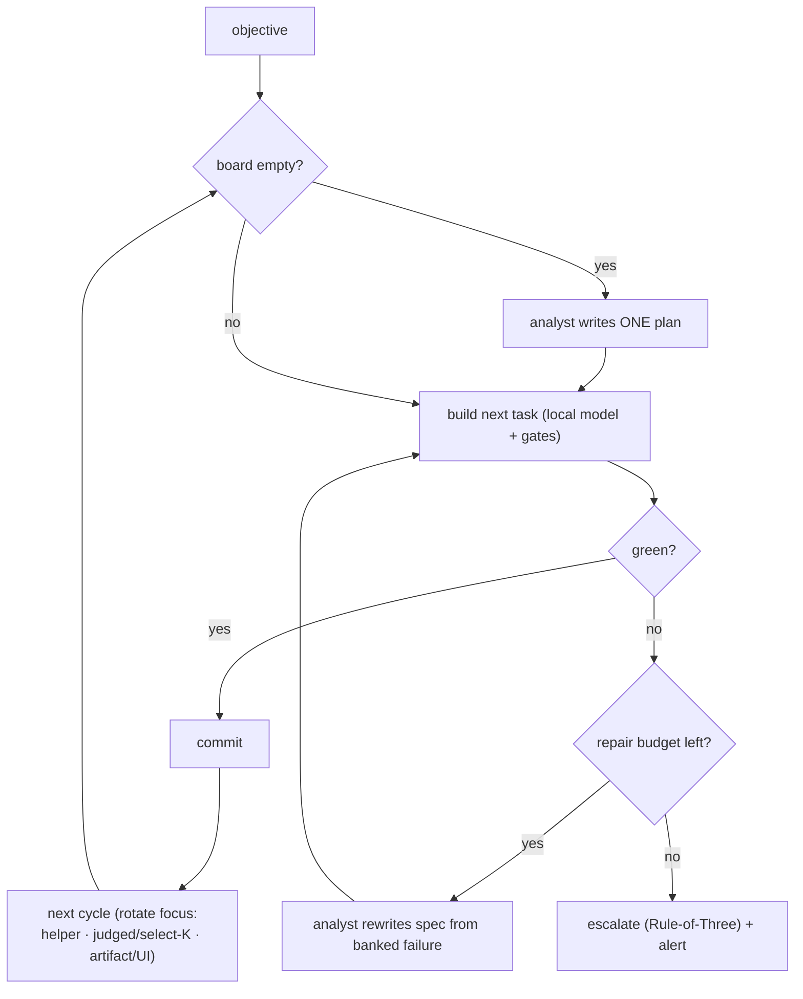
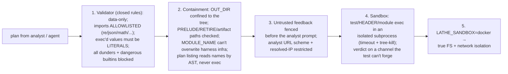

# Lathe — Install & Usage Guide

> **Treat AI code generation like a build system, not a conversation.**
> A spec‑driven, reproducible, gated harness for building software with LLMs. This guide covers install,
> the model, the CLI, every integration (Claude, any OpenAI‑compatible LLM, local models, or a
> human analyst), worked use cases, the security model, and troubleshooting.

---

## 1. The one‑minute model

Lathe splits codegen into two roles and refuses to let either do the other's job:

- **Analyst** (the *thinker* — a premium model, e.g. Claude, **or a human**): writes a **plan** = a spec +
  tests, per function. Rare, expensive tokens spent on judgment.
- **Implementer** (the *builder* — a cheap **local** model): writes the code to pass those tests. Free,
  abundant tokens spent on volume.
- **Gates** decide truth (unit tests · live‑browser behavioral test · design contract). Only gate‑passing
  output is accepted, then **pinned** by `hash(spec+tests+model)` so rebuilds are byte‑identical.
- On failure, the analyst **sharpens the spec from the real failing test** and retries — *no escalation to
  a bigger model*. Failures are assets; the system gets sharper as it ages.

```mermaid
flowchart LR
  A["Analyst (you + premium model OR a human)"] -->|writes| S["plan = spec + tests<br/>(source of truth)"]
  S -->|build| L["Implementer<br/>(cheap LOCAL model)"]
  L -->|code| G{"Gates<br/>unit · behavioral · design"}
  G -- PASS --> P["Pin: hash(spec+tests+model)<br/>→ reproducible rebuild"] --> SHIP(["ship / commit"])
  G -- FAIL --> B["Bank failure<br/>(candidate + exact failing test)"]
  B -->|sharpen the spec| S
  classDef think fill:#0F5132,color:#fff; classDef build fill:#1f6feb,color:#fff; classDef gate fill:#B45309,color:#fff
  class A,S think; class L build; class G gate
```

---

## 2. Prerequisites

| Need | For |
|---|---|
| **Python 3.11+** | the engine, CLI, gates |
| **A local model runtime** — [Ollama](https://ollama.com) *or* any OpenAI‑compatible server (llama.cpp `llama-server`, vLLM, LM Studio) | the implementer |
| **An analyst** — Claude (the bundled `claude_proxy.py` over the `claude` CLI), an API key, any OpenAI‑compatible LLM endpoint, *or you* | writing plans |
| *(optional)* `pip install playwright && playwright install chromium` | UI/behavioral gates |
| *(optional)* Docker | the fully‑isolated sandbox (`LATHE_SANDBOX=docker`) |

A 12B‑class local model (e.g. Gemma‑4‑12B QAT) runs the whole pipeline on an **8 GB GPU** at ~33 tok/s.
Bigger/smaller works — any model, local or remote.

## 3. Install

```bash
git clone https://github.com/go-yanka/lathe && cd lathe
# put the repo on PATH so `lathe` is typeable, or just call `python lathe.py ...`

# pick ONE implementer path and tell Lathe about it:
#  (a) Ollama:
ollama pull gemma2:12b
export LATHE_MODEL=gemma2:12b          # the CLI default is `openai:local`, so set this for Ollama
#  (b) OR any OpenAI-compatible server (llama.cpp / vLLM / LM Studio):
export LATHE_MODEL=openai:local
export LOCAL_OPENAI_URL=http://127.0.0.1:8080/v1/chat/completions

lathe selftest                   # confirms every capability + that your analyst/implementer endpoints answer
```

`lathe selftest` is the install check — it builds a pinned demo, runs the gate, and probes your analyst +
implementer endpoints, printing PASS/FAIL for each.

---

## 4. Quickstart — your first build

```bash
# one shot: analyst drafts a spec, the local model builds it, gates verify, it's pinned
lathe "parse a 'key=value;key=value' string into a dict"

# or build an existing plan file
lathe build examples/calc/plan_add.py
```

What happens, step by step:



---

## 5. The plan — the unit of work

A plan is a small **declarative, data‑only** Python file (the validator rejects executable top‑level code):

```python
OUT_DIR = r"./build"
MODULE_NAME = "calc"
HEADER = "import re"                          # imports + analyst-authored helpers, prepended verbatim
FUNCTIONS = [
    {
        "name": "slugify",
        "prompt": "slugify(s): lowercase, spaces->'-', strip non [a-z0-9-]. "
                  "Output ONLY the Python function code - no prose, no markdown.",
        "tests": ["assert slugify('Hello World')=='hello-world'",
                  "assert slugify('  A!!b ')=='a-b'",
                  "assert slugify('x')=='x'", "assert slugify('')==''"],
        # optional: "select": 2  (best-of-2, analyst picks the cleanest)
        # optional: "model": "claude"  (route THIS function to the analyst — for genuinely hard logic)
    },
]
GLUE = ""                                     # hand-authored wiring, appended verbatim (never generated)
INTEGRATION = ""                             # asserts the assembled module works as a whole
# optional: ARTIFACTS = [{path, prompt, tests, functional}]  — build a whole gated file/UI
```

Plans run in **filename order** (`01_…`, `02_…`) — the numeric prefix *is* the dependency graph. Full
field reference: `LATHE_CAPABILITIES.md` §2.

---

## 6. The CLI

| Command | What it does |
|---|---|
| `lathe "<goal>"` / `lathe do "<goal>"` | spec → build → gate → pin (one shot) |
| `lathe chat` | interactive REPL — each line is a goal |
| `lathe build <plan>` | run the engine on a plan file |
| `lathe auto ["<objective>"]` | autonomous loop: plan → build → **repair on failure** → commit |
| `lathe gate [h3\|h4\|h5\|h6\|all]` | run quality gates (regression by default) |
| `lathe review [lens\|all] <files>` | multi‑file, multi‑lens code review (correctness + adversarial) |
| `lathe status` / `lathe board` | board, pins, ledger, endpoint health |
| `lathe verify <plan>` | rebuild; pins reused ⇒ byte‑stable |
| `lathe decompose` · `lathe run` | seed the board from plans · drive the whole board to green |
| `lathe checkpoint [list\|snapshot\|restore <sha> --yes]` | git rollback points |
| `lathe metrics [N]` · `lathe plans` · `lathe selftest` | run history · list plans · confirm every capability |
| `lathe clarify "<goal>"` · `lathe sdlc "<goal>"` | liaison interrogates for a clear brief · author RTM-gated requirements |
| `lathe ack <plan>` · `lathe trace <plan>` | ack the test set · emit the criterion→test→pin→model matrix |
| `lathe assume <plan> [--resolve]` | surface + decide the goal's unstated assumptions, per-item (user-governed scrutiny) |
| `lathe agent <find\|rate\|bucket> …` | the persona market (match / rate / bucket experts) |

Strict methodology in one switch: `LATHE_STRICT=1 lathe build <plan>` forces all seven enforcement gates
(regression-proof, mutation-score, test-ack, test-kind, glue, traceability, and the assumption gate). Full
reference + the "always review through Lathe" rules: `LATHE_COMMANDS.md`.

---

## 7. Integrations — use Lathe with *anything*

Both roles are **pluggable endpoints**. Lathe ships no model and is provider‑agnostic.



### 7a. With Claude (default, $0 via subscription)
```bash
python claude_proxy.py --port 8787 &                 # shells `claude -p` (run `claude login` once)
export HARNESS_CLAUDE_URL=http://127.0.0.1:8787/v1/chat/completions
```
The proxy maps `haiku|sonnet|opus`. **Shipping note:** a *hosted* product must use **per‑user API keys** —
Anthropic prohibits routing other users through one subscription. Solo/internal use of the subscription is
fine.

### 7b. With any other LLM as the analyst (GPT, Gemini, a local big model)
```bash
export HARNESS_CLAUDE_URL=https://your-openai-compatible-endpoint/v1/chat/completions
# (point it at OpenAI, an Azure deployment, OpenRouter, a local 70B server — anything OpenAI-compatible)
```

### 7c. With a local implementer (Ollama or any OpenAI server)
```bash
# Ollama (default): plan/CLI uses a bare model name
lathe build plan.py gemma2:12b
# OR an OpenAI-compatible local server (llama.cpp, vLLM, LM Studio):
export LOCAL_OPENAI_URL=http://127.0.0.1:8080/v1/chat/completions
lathe build plan.py openai:local
```

### 7d. With **no LLM analyst at all** — a human writes the plans
Skip `HARNESS_CLAUDE_URL` entirely; write `plans/NN.py` by hand and `lathe build` them. The local model
still does all the coding; you provide the specs. This is the cheapest, most private mode.

### 7e. With Claude Code / any shell-running agent (agent‑native)
Any agent that can run a shell uses Lathe by calling the CLI. Tell the agent (in its system prompt/SOUL):
> *"For any code generation, don't free‑hand edit — drive the Lathe CLI: `lathe \"<goal>\"` to build,
> `lathe review` to verify, `lathe status` to inspect. Code is a build output; change the plan and
> regenerate."*
Proven live: a local desktop agent given a coding task ran `lathe`, the engine built, and the results
landed in the metrics ledger. See `LATHE_COMMANDS.md` for the command surface.

### 7f. In a dev environment / CI
`lathe build` and `lathe gate` are exit‑coded; wire them into pre‑commit or CI. Pins make rebuilds
deterministic, so a Lathe‑built module is reproducible across machines.

---

## 8. Autonomous mode — the harness drives itself

```bash
echo "Build a metrics-parsing toolkit: one small tested pure function at a time." > _self_feed_objective.txt
lathe auto                      # or schedule self_feed_runner.py to run every few minutes
```



Unattended, resumable, git‑committed (every build is rollback‑safe). The loop self‑corrects via the
repair arc instead of grinding.

---

## 9. Security model — plans are executed, so read this

Lathe runs plan code and test assertions, like `make`/`pip` run build scripts. **Treat plans like build
scripts: only run ones you trust.** Defense in depth, smallest‑blast‑radius first:



The validator is built on **closed rules, not denylists** (the distinction that survived a multi-round
adversarial review of the harness *by itself*): imports are an **allowlist** of pure-compute stdlib —
anything else (`io`, `http`, `os`, `subprocess`, `gzip`, …) is rejected; every value the engine later
`exec`s (HEADER/GLUE and each `tests`/`functional` field) must be a **pure literal**, so the string that
was scanned *is* the string that runs (no `"imp"+"ort os"`, no `dict(tests=[…])` that dodges the scan);
and **all dunder access + dangerous builtins** (`eval`/`getattr`/`open`/…) are blocked, closing the
attribute-traversal escape class rather than chasing instances.

**What is sandboxed, and when — read carefully:**
- The **autonomous loop** (`lathe auto` / the self‑feed runner) builds **with the subprocess sandbox ON**
  by default — its plans come from an LLM and are treated as untrusted. It **forces** the sandbox/validate
  knobs (a hostile parent env can't downgrade them) and re-verifies each built unit *through the sandbox*.
- **Manual `lathe build` / `verify` / `selftest` run IN‑PROCESS** (the fast path) — they execute the plan's
  HEADER, the generated code, and the tests in *your* process. Run these **only on plans you trust**, like
  `make`/`pip` and a `setup.py`.
- To isolate a manual build too, set `LATHE_SANDBOX=subprocess` (or `docker`) in the environment. If the
  mode is set, the engine **fails loud** rather than silently running in‑proc (no false sense of safety),
  and it loads the sandbox **only from trusted infra**, never from the model-writable output dir.

**The irreducible boundary (stated plainly):** to *build* software, the engine must `exec` the
implementation code a model wrote — and that code can legitimately need `os`/`subprocess` (it implements
real functions), so it **cannot** be statically allowlisted the way a *plan* can. Each unit is test-gated
in the sandbox first, output is confined to `OUT_DIR`, and the harness's own files are overwrite-protected
— but a plan you build is still code you run. For fully-untrusted plans/models, **build under
`LATHE_SANDBOX=docker`**. Otherwise: treat a plan like a build script and only run ones you trust.

Sandbox modes (`LATHE_SANDBOX`):
- `subprocess` — process isolation + hard timeout + process‑tree kill. Portable; contains
  crashes/hangs/escapes. **Not** filesystem confinement on stock Windows.
- `docker` — throwaway container, no network, read‑only rootfs — **true FS/network isolation** for
  fully‑untrusted plans/models.
- unset / `0` — fast in‑proc (trusted plans only; the default for manual builds).

⚠️ **Bottom line:** the validator + sandbox are *defense in depth*, not a guarantee. **Don't run untrusted
plans.** Treat a plan file like a build script. Details: `LATHE_CAPABILITIES.md` §8.

---

## 10. Configuration reference (environment variables)

**Config file (optional).** Instead of exporting these one by one, copy `lathe.config.example.json` to
`lathe.config.json` (gitignored) and set your `analyst`/`implementer` `{url, model}`, `tries`, and `checkin.remote`
there. Precedence is **env var > config file > built-in default** — an explicit env var always wins. Point
`analyst.url` at `claude_proxy.py` to drive the *thinking* from a Claude subscription ($0/token) while a local
`implementer` does the bulk; set `implementer.model` to a strong model too for max correctness. **Never** put a
push token in the file — use an env var or the git credential helper. (Parsing is harness-built: `lathe_config`.)

| Var | Role | Default |
|---|---|---|
| `HARNESS_CLAUDE_URL` | **analyst** endpoint (OpenAI‑compatible) | `http://127.0.0.1:8787/v1/chat/completions` |
| `HARNESS_MODEL` | default **implementer** model | `gemma4:12b` |
| `LOCAL_OPENAI_URL` | endpoint for `openai:*` implementer models | llama‑server `:8089` |
| `LOCAL_OPENAI_MAXTOK` / `LOCAL_GEN_TIMEOUT` | implementer `max_tokens` cap / generation timeout (s) | `16384` / `900` (openai) · `300` (ollama) |
| `OLLAMA_URL` | endpoint for bare‑name (ollama) models | `http://localhost:11434` |
| `LATHE_MODEL` / `LATHE_TRIES` | CLI default implementer / best‑of‑N | `openai:local` / `3` |
| `LATHE_SANDBOX` | `subprocess` · `docker` · `0` | (autonomy sets `subprocess`) |
| `CLAUDE_TIMEOUT` / `CLAUDE_RETRIES` | analyst call bounds | `120` / `2` |
| `FUNC_GATE_TIMEOUT` / `ITEST_TIMEOUT` / `REGRESSION_TIMEOUT` | gate timeouts (s) | `360` / `360` / `300` |
| `SKIP_REGRESSION` / `RUN_GATES_PATH` | regression gate control | — |
| `LATHE_AUTO_COMMIT` | opt-in: let autonomy (`auto`/`do`/`run`) commit green builds to git | unset (**off** — no commits) |
| `LATHE_REVIEW_USE_CLI` | use the `claude` CLI for `review` when present; `0` forces the `HARNESS_CLAUDE_URL` endpoint | `1` |

**Gate toggles (the rigor knobs).** The gates that decide whether generated code is accepted are all
configurable. `LATHE_STRICT=1` turns the whole rigor suite on at once; each gate is also switchable and
tunable on its own, and an explicit var always wins over STRICT (so you can go stricter, or drop one gate):

| Var | Gate | Values | STRICT default |
|---|---|---|---|
| `LATHE_STRICT` | composes all seven below (+ requires plan `CRITERIA`) | `1` | — |
| `LATHE_REGRESSION_PROOF` | a bug fix must ship a failing-on-old-code test | `1`/`true`/… | `1` |
| `LATHE_LINT_SPEC` | reject tests a trivial stub can satisfy | `warn` / `block` | `block` |
| `LATHE_MUTATION_SCORE` | min fraction of mutants the tests must kill | float `0.0`–`1.0` | `0.5` |
| `LATHE_TEST_ACK` | a human must ack the AI-written tests (`lathe ack`) | `1`/`true`/… | `1` |
| `LATHE_TEST_KIND` | require declared test *kinds* (property/edge/error) | `1`/`true`/… | `1` |
| `LATHE_GATE_GLUE` / `LATHE_GLUE_MAX` | substantive glue needs an INTEGRATION test / line threshold | `1`; int (dflt `2`) | `1` |
| `LATHE_ASSUMPTION_GATE` / `LATHE_ASSUMPTION_POLICY` | refuse while a material assumption is unconfirmed / scrutiny | `1`; `off`/`high`/`med`/`all` | `1`, `high` |

> **Every gate in full — `docs/GATES_REFERENCE.md`.** All sixteen gates (seven build-time rigor gates, seven
> standing tree gates, the acceptance floor), each with its exact passing criteria, failure message, config
> knobs, and implementation. This table is the summary; that doc is the reference.

---

## 11. Troubleshooting

| Symptom | Fix |
|---|---|
| `lathe selftest` shows analyst `down` | start `claude_proxy.py` (or set `HARNESS_CLAUDE_URL`); run `claude login` |
| analyst `up` but plans rejected | the model isn't emitting a data‑only plan — check `docs/ce/` / the ledger reason; the repair loop will retry |
| implementer `down` | start Ollama / your OpenAI server; check `LOCAL_OPENAI_URL`/`OLLAMA_URL` |
| every build is slow | best‑of‑N × functions; lower `LATHE_TRIES`, or use a faster local model; pins make rebuilds instant |
| UI gates fail to launch | `pip install playwright && playwright install chromium` |
| want to audit a build | `lathe metrics`, `lathe status`, `RUN_REPORT.md`, the `runs.jsonl` ledger |

---

## 12. Where to go next
- `SECURITY.md` — the full security model: threat model, the four defense layers, and the honest boundary (audited over ~18 rounds of `lathe review`)
- `LATHE_CAPABILITIES.md` — the complete capability map (build modes, gates, autonomy, safety)
- `LATHE_COMMANDS.md` — every command + the review discipline
- `LATHE_DEPENDENCIES.md` / `THIRD_PARTY_NOTICES.md` — licenses & attributions
- `docs/HOW_IT_WORKS.md` — the plan format and a real multi‑plan app, end to end
- `PRIOR_ART.md` — honest map of the ideas Lathe stands on
