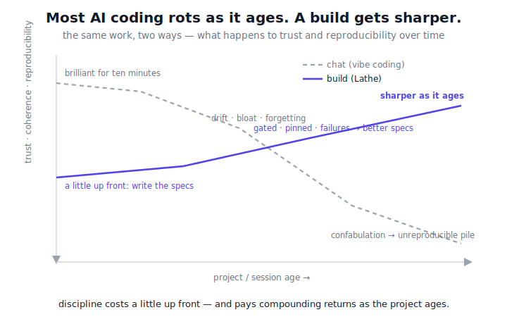
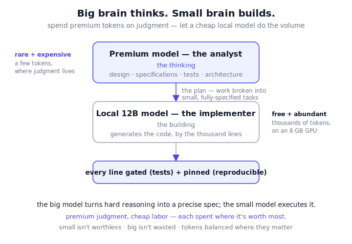
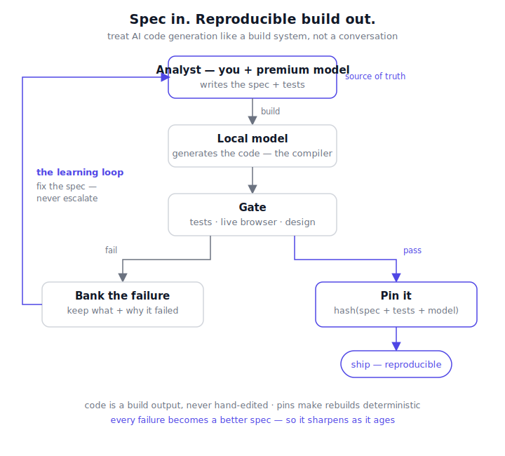

# Lathe: stop chatting with the AI. Build with it.

### How to get AI to write software that is correct, identical every time, and runs on a cheap gaming PC — by treating code generation like a build system instead of a conversation.

*An honest field report. Built independently; mapped to prior work afterward (see the end). The ideas are
the author's, from years of plain old software engineering; an LLM did the implementation.*

---

## You already know the problem

You start a coding session with an AI. It's brilliant for ten minutes. You have a clear goal and clean
code.

Then it rots.

Ask for the same thing twice and you get two different answers. Thirty messages in, you've drifted
somewhere you never chose. The chat gets long, the model gets slow and forgetful, your earlier decisions
quietly get contradicted. It tells you something works when it doesn't. You hand-fix one file and now
nothing can be regenerated cleanly. By the end you have *a pile of code that happens to work right now* —
and no way to rebuild it, reason about it, or trust it tomorrow.

This isn't a you problem. It's measured: a recent study ran 300 AI-generated projects from three frontier
coding agents in clean environments and **only 68% even ran out of the box** (Java: 44%). Same prompt,
different code, no reproducibility.

The root issue is simple:

> ## A conversation is not a build.

You can't rebuild a conversation. You can't diff it, pin it, or trust it to come out the same way twice.



And the deepest consequence — the one we'll come back to: when code is a *build output* you can never
hand-patch, **fixing a bug forces you to fix the design.** Thinking changes first; code follows. The
system can't quietly rot, because there's no back door to rot through.

## The fix is old, not new

Before AI, we already knew how to make large software tractable, and none of it was magic:

- **You keep the source, not the binary.** The binary is something you *build* from the source, on demand.
- **You write a test, then the code that passes it.** The test is the contract.
- **You don't merge red.** If it fails the check, you fix it — you don't ship it.
- **You commit a lockfile** so everyone's build is identical.
- **Every bug becomes a test** so it can never come back.

Lathe is just those habits, pointed at an LLM. The LLM is fast but flaky — it drifts and confabulates.
These old habits are exactly the leash. **The trick isn't a smarter model. It's refusing to treat
generation as a chat, and treating it as a build instead.**

## What you actually get

- **Correct code, every run.** Nothing ships unless it passes its tests. The system is correct by
  construction — not "the model seemed confident."
- **Identical rebuilds.** Build it today, build it next month: byte-for-byte the same. The pin *is* the
  accepted code itself — committed, and keyed by `hash(spec + tests + model)`. A rebuild **reuses** the
  pinned output instead of re-running the model, so reproducibility never depends on taming the model's
  randomness — it sidesteps it. (Same idea as a `package-lock.json`.)
- **It gets *better* as it ages, not worse.** Every failure is banked and turned into a sharper spec, so
  tomorrow's build needs fewer tries than today's.
- **The volume runs on hardware you already own.** A quantized local model generates the code on an 8 GB
  gaming GPU — for free, no per-token bill. Only the *thinking* (the specs) uses a premium model, and that
  step is small — it can even be a human or a local model.

How? By spending each kind of model where it's worth most — premium judgment on the specs, cheap local
muscle on the volume:



## The whole trick is one file

The magic isn't the engine. It's the **plan** — a small file where you write, *for each function*, what it
should do and the tests that prove it. That file is the real source of your software. The code is just
what gets built from it.

Here's a real one (it shipped):

```python
FUNCTIONS = [
    {
        "name": "_is_standalone_word",
        "prompt": "Return True if `word` appears as a whole word in `text`, else False. "
                  "Use a regex word boundary.",                       # <- the design / what you want
        "tests": [                                                    # <- the contract / proof it's right
            "assert _is_standalone_word('director','associate director') == True",
            "assert _is_standalone_word('analyst','data analytics') == False",
        ],
    },
]
```

That's the part most people miss. Other tools write a *big* spec for a whole feature and let the AI run
wild inside it. Lathe goes down to the **single function**: a tiny job, with a tiny exact test. That
granularity is *why it works* —

- a job that small is something even a cheap local model can nail,
- a test that exact leaves no room to "sort of" pass,
- and you can pin each function on its own, so changing one doesn't disturb the rest.

You write the *intent*. The machine builds the *code*. For the full format — how design is spelled out, how
modules wire together, how UI pages are generated and tested in a real browser — see
[docs/HOW_IT_WORKS.md](docs/HOW_IT_WORKS.md). It's the most useful page in this repo.

## Does it scale past one function?

Yes — the way builds always have: by composition. Functions assemble into modules; modules are **ordered
plans** (`01_…`, `02_…`); later plans build on earlier ones, and an integration test guards every boundary.
The real application behind this paper is **23 ordered plans** — a scoring engine, 47 data-source
ingesters, an AI layer, a FastAPI server, and model-generated UI — built and reproduced end to end. *(That product is private and is **not** included in this public repository, so this specific scaling claim cannot be verified from what ships here — a public multi-plan demo is planned to make it falsifiable.)*

Macro-architectural changes work exactly like bug fixes: you change the *upstream* plan, and everything
downstream regenerates and re-gates. There is no hand-written code to keep in sync, because the code was
never the source — the plans are. **Big changes are spec changes; the build does the rest.**

## The loop, in one breath



For each function: **generate → run its tests → if it passes, pin it; if it fails, don't escalate — fix
the spec.**

That last clause is the contrarian one, and it matters. Every other "cheap model + expensive model" setup,
when the cheap model fails, *kicks the problem up to a bigger model.* Lathe refuses. A failure means the
**spec** was unclear, so you make the spec clearer — and now the cheap model can do it, forever, for free.
The expensive model (or your own brain) is spent on *thinking* — writing specs and tests — never on
grinding out code.

## Why it gets sharper as it ages

When the model fails, Lathe doesn't just retry and forget. It **saves the failed attempt and the exact
reason it failed.** That's the raw material for a better spec.

This is the difference between *looking* smart and *being* smart:

- Re-rolling the dice until you get a pass is just luck. The system learned nothing.
- Turning that failure into a clearer spec means the *next* build is one try, not four — and so is every
  build after it.

Retries are sampling. **Banked failures becoming better specs is learning.** Do this across a project and
across many projects, and the harness compounds: the cost curve bends down as it ages. That's the design *intent* — the cost curve should bend down as it ages. (A claim about direction, not a measured track record yet.)

## Fixing a bug becomes a design decision

This is the part we think is genuinely new, so we'll state it plainly.

In normal development, a bug fix is a **patch**: find the line, change the line, move on. The design — if it
was ever written down — rots a little more each time, because the code drifts away from the intent with
every quick fix.

Lathe makes patching **impossible, on purpose.** You can't edit the code; it's a build output. The only
thing you can change is the plan — the design and the tests. So fixing a bug means going back to the
*intent* and revising it.

That has a consequence we didn't engineer for and haven't seen elsewhere: **every bug forces the design to
be re-examined before anything can be corrected.** The model (or the human) can't slip in a tactical patch
to silence the symptom and call it done. To fix *anything*, you have to re-open the design, decide what the
behavior should actually be, change the *thinking* — and the corrected code falls out of that, regenerated
and re-gated.

The rule, in one line: **implementation never changes unless the thinking changes first.** A bug isn't a
place to patch; it's a question about the design. The fix is a sharper spec plus a test that locks it in.

And this is what keeps determinism alive *over time*. In most projects, reproducibility — if you ever had
it — dies the first time someone hand-patches a fix. Here, fixes flow *through* the design, not around it,
so the system stays coherent and reproducible across its whole life, not just at first build. **Determinism
survives maintenance.**

## Why it actually works (no hand-waving)

Three plain reasons, and the research happens to back each one:

1. **Small, well-specified jobs are reliable jobs.** A small model doesn't fail because it's small — it
   fails when it's handed too much with too little context. Give it *one* bounded task with the design
   spelled out, and it performs at its peak. The big model's real job is that handoff: see the whole
   system, break it into small fully-specified pieces, and give each piece the context that makes it
   doable. That decomposition — the analysis, the architecture, the bigger picture — is exactly what the
   premium model's advanced training is *for*, and the part a small model can't do. The small model just
   executes the now-easy pieces. **Quality lives in the design, not the typing** — which is why moving the
   typing to a free, local model costs you nothing in quality, and why the trade pays off like no other:
   premium tokens for the rare, valuable thinking; free local tokens for the abundant, mundane volume.
2. **A test is an honest judge.** "Does it pass?" has one answer; the model's confidence doesn't get a
   vote. For a UI, that judge is a real headless browser — it loads the page, clicks a button, and checks
   the live DOM did the right thing (e.g., *clicking Save fired a `PUT /api/config` with the correct
   payload*). "Looks done" can't pass for "works." (Reliably catching wrong AI output is a *named open
   problem* in the literature; a real test is a blunt, effective answer.)
3. **A lockfile makes a build reproducible.** Nothing exotic — it's how every package manager already
   works.

And the contrarian choices aren't just style; they're the rational response to what researchers found is
actually broken:

- Self-fixing is bottlenecked by **feedback quality, not model size** — better critique lifted success
  ~1.58×; letting a model critique itself barely helped. *So we invest in the spec, not the model.*
- **Small models often can't fix their own code even when told what's wrong.** *So we don't ask them to —
  we fix the spec instead of escalating.*

The architecture lands exactly where the evidence says it should.

## It runs on a cheap gaming PC (this is the part people don't believe)

The whole thing — local code generation, the tests, even a real headless browser checking the UI, and the
reproducible build — was built and runs on a **2019 mid-range gaming PC: an 8 GB RTX 2060 Super with 16 GB
of RAM.** A used one costs a couple hundred dollars. A quantized 12B model does the coding at ~33 tokens a
second, entirely on the card.

This isn't a lucky accident — it's the design. The scarce thing (judgment) is spent only on specs; the
cheap thing (a small local model) does the volume. So the code is generated on your own GPU at essentially
zero marginal cost, and the one premium step is the thinking — writing the specs. We used Claude for that
(a cloud model), but the analyst role can equally be a human or a local model. To be precise: the *code
generation* is fully local; the *spec authoring* is where a premium model earns its keep. Reproducible,
gated, mostly-local AI development, within reach of a hobbyist, not just a lab.

And it isn't tied to one card. The architecture cares about *a small local model*, not the brand of
silicon — the same method runs on AMD GPUs via Vulkan, on Apple Silicon, or on any ~8 GB-and-up
accelerator. The RTX 2060 Super is simply what we used. The method is the constant; the hardware is
swappable.

## What's ours, what's borrowed

We'll be exact, because exactness is the point.

**Borrowed** — and we use the field's names for them: specs-as-source, test-gated generation, learning from
failure, cheap-model-does-the-work, running a local model. All of these exist (see the references). None is
ours, and we don't pretend otherwise.

**Ours is the combination, and four deliberate choices inside it:**

- **Per-function specs + tests as the unit of generation** — not a feature-level spec, not a task-level
  test, but design-and-proof for a *single function*. This granularity is what makes a cheap model reliable
  and the pins fine-grained.
- **Refuse to escalate** — a failure fixes the spec; it doesn't summon a bigger model.
- **Pin the output** — so rebuilds are byte-identical, which the spec-driven tools we read do not do.
- **No back door to patch** — so every bug fix is a forced design revision, and determinism survives
  maintenance instead of dying at the first hand-fix.

This is a *working recipe*, not an invention — composed, tested in anger, and presented with the scars.

**Scope of the claim:** we verified "unoccupied" against the tools we read in primary sources; the
per-function and design-revision choices are strong candidates we have not yet surveyed exhaustively. The
full map — borrowed, unoccupied, and unverified, line by line — is in [PRIOR_ART.md](PRIOR_ART.md). We claim
what we verified, and we name the rest as open.

## The takeaway

Determinism isn't something you wait for the next model to give you. It's a **choice you make in how you
build.** Stop having a conversation with the AI and hoping. Write down what you want, function by function,
with a test that proves it. Let a cheap local model build it. Gate it. Pin it. Bank every failure as a
better spec.

Do that, and the thing you're building stops drifting and starts compounding — sharper as it ages, on
hardware you already own. That's the old wine. The new bottle just needed it.

## Try it

The engine, the gate, the pinning, and a runnable demo are open source (MIT). The fastest way to *feel* the
difference is to watch the loop run — a couple of minutes with [Ollama](https://ollama.com) and a local
~12B model:

```bash
# we run a Gemma 4 12B QAT quant, 100% on an 8 GB GPU (any ~12B local model works)
python engine.py examples/calc/plan_add.py gemma4:12b 3   # generate → gate → pin
python engine.py examples/calc/plan_add.py gemma4:12b 3   # re-run: pinned, byte-identical
```

Then read [`docs/HOW_IT_WORKS.md`](docs/HOW_IT_WORKS.md) for the real plan format, and try writing *one*
function as a plan — a design and a test — and building it. That single loop is the whole idea in your
hands.

→ **Code & docs: [github.com/go-yanka/lathe](https://github.com/go-yanka/lathe)**

---

## Appendix A — The plan format

A plan is a Python file declaring any subset of these:

```
MODULE_NAME : str         # output module name (writes MODULE_NAME.py)
OUT_DIR     : str          # output directory (default: the plan file's own directory)
HEADER      : str          # imports prepended to the generated module
FUNCTIONS   : list[dict]   # each: {"name", "prompt" (design+expectations), "tests" (the contract)}
GLUE        : str          # hand-authored wiring appended verbatim (NOT generated)
INTEGRATION : str          # a script that imports the module and asserts; exit 0 = pass
ARTIFACTS   : list[dict]   # UI etc.: {"path","prompt","tests" (structural), "functional" (browser test)}
```

Plans run in **filename order** (`01_…`, `02_…`); later modules build on earlier ones — the numeric prefix
is the dependency order. Full worked walkthrough with real artifacts:
[docs/HOW_IT_WORKS.md](HOW_IT_WORKS.md). A minimal runnable example: `examples/calc/plan_add.py`.

## Appendix B — What we used (and why it doesn't matter much)

The thesis is model- and hardware-agnostic; better ones only raise the ceiling.

- **Hardware:** 8 GB RTX 2060 Super, 16 GB RAM, a 2015 CPU. Display offloaded to the integrated GPU so all
  8 GB is free for the model.
- **Implementer (local):** started with a small Qwen model (fine on easy functions, flaky on hard ones),
  moved to a **Gemma 12B quant** for reliability — 100% on the 8 GB GPU at ~33 tok/s. For UI pages we
  raised the context from 8K to 16K so it could emit a whole page; still fully on the GPU.
- **Analyst:** a premium model (Claude), used *only* to write the plans — design, expectations, tests.
- **The path:** Qwen → Gemma 12B → 8K → 16K. None of it is the point. The point is that a *local* model,
  with judgment outsourced to the analyst and behavior locked by per-function specs + gates + pins, built a
  real, reproducible product on ordinary hardware.

## References

A few primary sources behind the claims above (the full honest prior-art map is in `PRIOR_ART.md`):

- *AI-Generated Code Is Not Reproducible (Yet)* — arXiv:2512.22387 (the 68% figure).
- Olausson et al., *Is Self-Repair a Silver Bullet for Code Generation?* — ICLR 2024, arXiv:2306.09896.
- Pan et al., *Automatically Correcting Large Language Models* — TACL 2024, arXiv:2308.03188.
- Fan et al., *LLMs for Software Engineering: Survey and Open Problems* — arXiv:2310.03533.
- Mathews & Nagappan, *Test-Driven Development for Code Generation* — arXiv:2402.13521.
- Shinn et al., *Reflexion* — arXiv:2303.11366. · Chen et al., *FrugalGPT* — arXiv:2305.05176.
