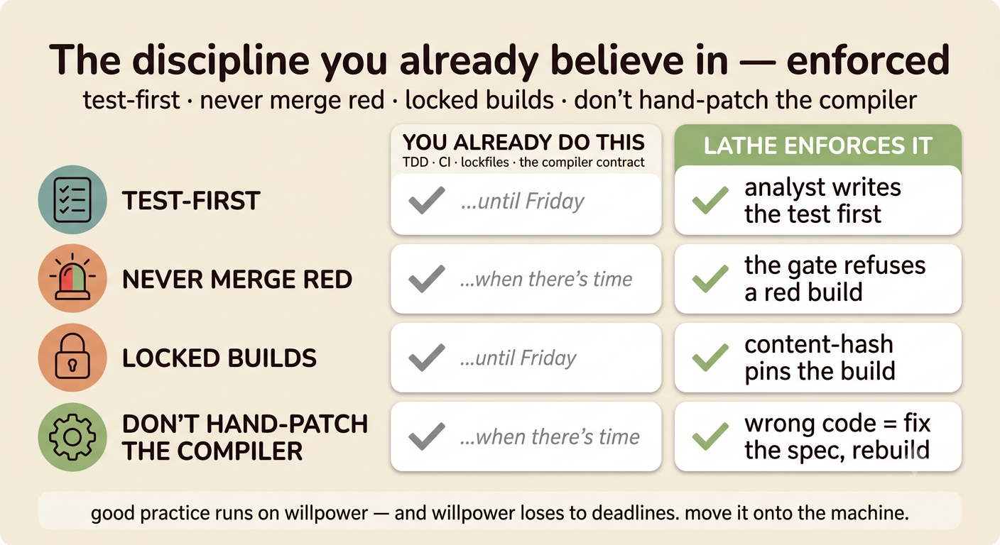
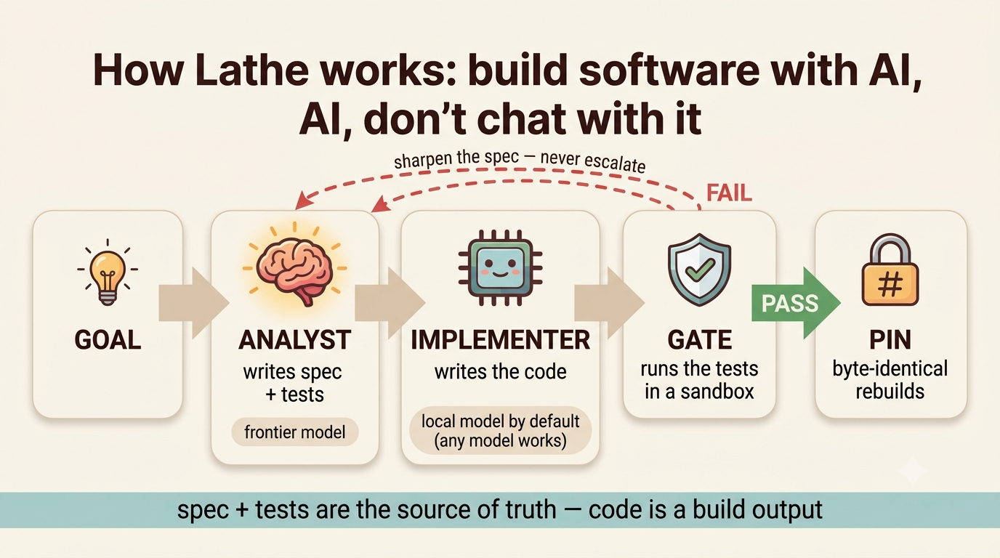
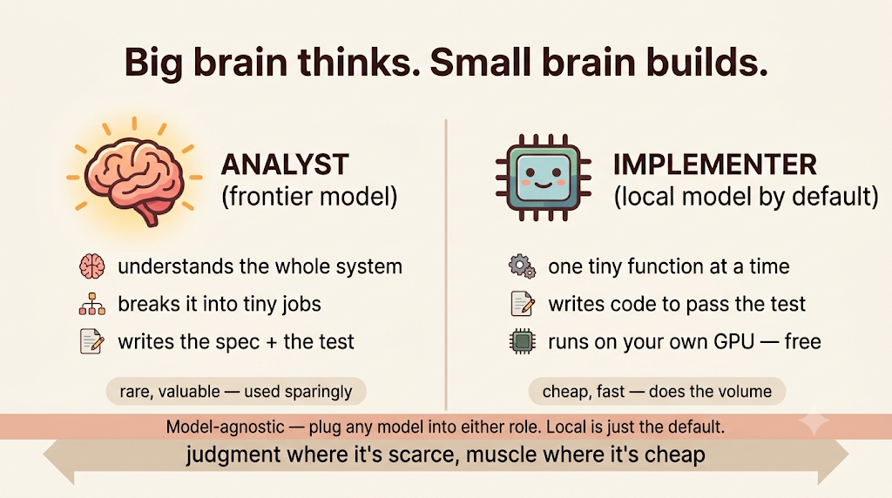
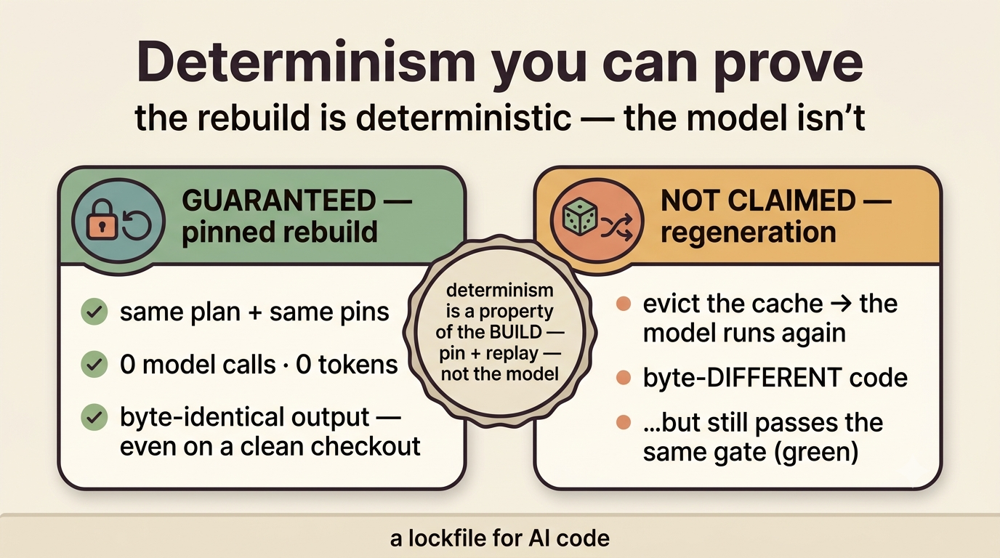
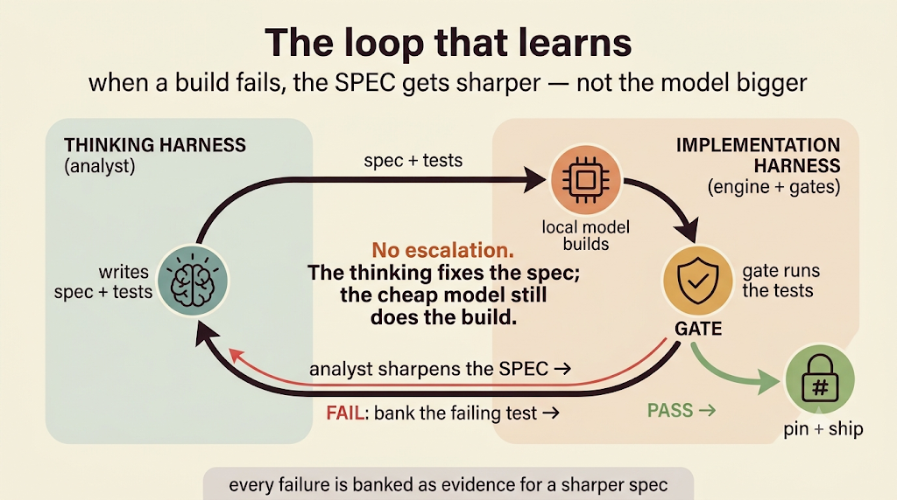
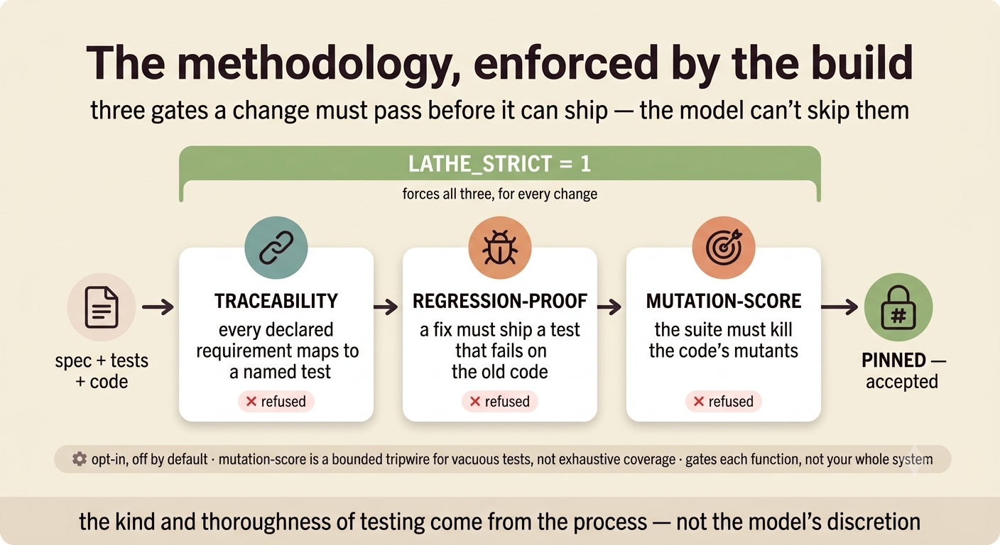
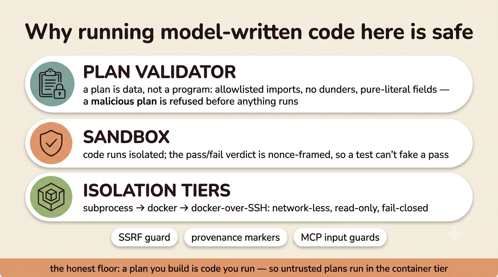
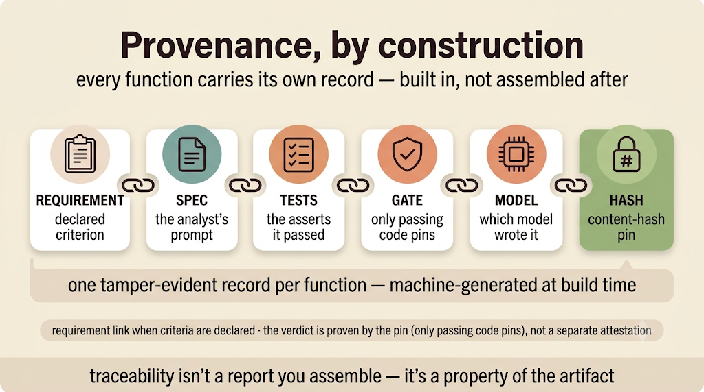
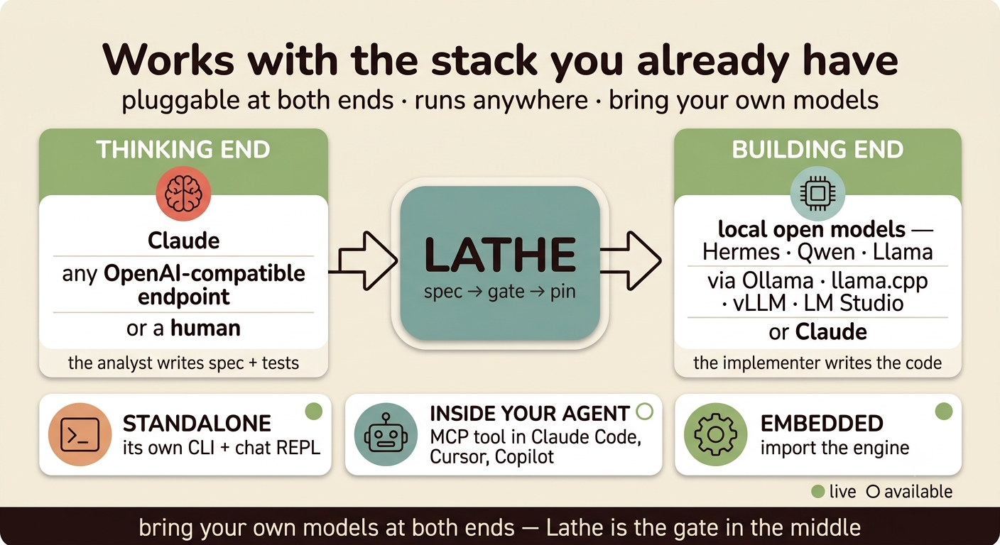

# Stop chatting with the AI. Build with it.

*An introduction to Lathe — a test-driven build engine for LLMs. Written by Fable. Every claim here is
either shown with a runnable example or labelled honestly as untested; the numbers that aren't proven are
marked as invitations, not results. That is the whole point of the tool, so it is the whole point of this
article too.*

---

## The two rooms

Walk through any engineering org in 2026 and you'll find the same two rooms.

In the first room, half the team has quietly wired an AI into their editor and ships whatever it writes.
It's fast. It's also unreviewed, unreproducible, and nobody can tell you which model wrote line 40 or what,
exactly, that line was ever supposed to do.

In the second room, the other half doesn't trust any of it. They've seen the confident nonsense. So they
write everything by hand and watch the first room move twice as fast, and worry.

Both rooms are right. AI codegen *is* fast, and it *is* untrustworthy. The mistake is thinking you have to
pick one.

Lathe is a third room. It treats a language model the way a compiler treats you: as something that proposes
code, which then has to pass a gate before it counts. You don't chat with it and hope. You hand it a
contract and it either meets the contract or it doesn't ship. Same idea we've trusted for fifty years —
tests, CI, lockfiles — except the machine enforces it instead of your willpower at 6pm on a Friday.

Here's how it actually works, with a real function, and here's where it honestly falls short. If by the end
you don't want to try it once, I've failed and you should close the tab.


*You already do all four of these — test-first, never merge red, locked builds, don't hand-patch the
compiler. Lathe's only trick is moving them off willpower and onto the machine.*

---

## The core move: a contract, not a conversation

Say you need a function that parses a dollar string into integer cents. In most AI tools you'd type "write
me a function to parse money" and start negotiating with the output.

In Lathe you write a *plan* — a small, plain description of the contract:

```python
FUNCTIONS = [{
    "name": "to_cents",
    "prompt": "Write to_cents(s: str) -> int. Parse a dollar amount like '$1,234.50' into integer cents "
              "(123450). A bare integer like '12' means 12 dollars. Raise ValueError on anything malformed.",
    "tests": [
        "assert to_cents('$1,234.50') == 123450",
        "assert to_cents('$0.05') == 5",
        "assert to_cents('12') == 1200",
        "try:\n    to_cents('nope')\n    assert False\nexcept ValueError:\n    pass",
    ],
}]
```

That's the unit of work: one function, a prompt that says what it must do, and the tests that decide whether
it did. Notice the tests are written *first*, and they're the real thing — not "does it look right," but
executable asserts including the failure case.

Now you build it:

```
$ lathe build money.py
  to_cents        PASS (local)   1 try   (4 tests)
```

Here's what happened in that one line:

1. A **cheap, local model** — a 9–12B model running on your own machine via Ollama, llama.cpp, vLLM, or LM
   Studio (or any OpenAI-compatible endpoint) — wrote a candidate implementation.
2. A **sandbox** ran your four asserts against it.
3. Because they passed, the code was **accepted** and **content-hash pinned**.

If the model had produced something that failed even one assert, you would not have gotten a broken function
to fix. You'd have gotten a refusal. The gate is not a suggestion the model can talk its way past; passing
the tests is a *precondition on the artifact*, decided outside the model's reach.


*The loop in one picture: spec + tests in → a cheap model builds → the gate runs the tests → passing code is
pinned; a failure loops back as a sharper spec, never a bigger model.*

The division of labour matters here, and it's the quiet insight of the whole system: **the thinking is
expensive, the building is cheap.** A frontier model (or you) writes the spec and tests once. A small local
model does the repetitive work of turning that contract into code — a job it's genuinely good at, precisely
because the contract is narrow and the gate catches its mistakes. You are not asking a weak model to be
clever. You're asking it to fill in a blank, and checking its work.


*Big model (or human) for judgment — the spec and tests. Small local model for volume — the code. The
machine for discipline — the gate. Any model at either end.*

---

## The part that makes people sit up: delete the code

Content-hash pinning sounds like a footnote. It's the headline.

When `to_cents` passed, Lathe recorded a pin keyed by a hash of the spec, the tests, and the model. Now do
something that feels reckless:

```
$ rm money_impl.py          # the generated code lands in <name>_impl.py; delete it
$ lathe build money.py
  to_cents        REUSED     0 tokens
```

The function came back **byte-for-byte identical, with zero model calls.** Not "regenerated and probably the
same" — replayed from the pin, deterministic, free. Clone the repo on a fresh machine, with the pins
committed and untouched, and you get the same bytes. (One caveat worth stating plainly: the pin is keyed on
a hash of the exact spec text, so *any* edit to the spec — even a reflow or a fixed typo — misses the pin and
forces a regeneration, which is the nondeterministic path. Byte-identity is a property of an unchanged,
committed pin, not of the spec's meaning.) The generated code was never the source of truth. **The spec
was.** The code is a build artifact, the way a compiled binary is a build artifact — reproducible from its
inputs, not something you edit by hand.

And that's the rule that trips people up at first and then becomes the thing they like most: **you never
hand-edit the output.** Wrong behaviour? You don't patch the code — you sharpen the spec and rebuild. If
that sounds rigid, it's the same rigidity as "don't edit the compiler's output," and you already live by it.

I want to be precise about determinism, because it's easy to over-claim and a skeptic will catch you. The
model is *not* deterministic. If you evict the pins and regenerate from scratch, you may get different bytes
that pass the same tests. That's fine — that's expected. The determinism is a property of the **build** (pin
+ replay), not of the model. Lathe is a lockfile for AI code: the *rebuild* is reproducible, the *model*
isn't. We measured both and wrote both down.


*Two honest lanes. Left, guaranteed: a pinned rebuild is byte-identical at zero tokens. Right, never
claimed: regenerate from scratch and you may get different bytes — that still pass the same gate.*

---

## When it fails, the spec gets sharper — not the model bigger

Real work isn't one-shot. So watch a failure.

You find a bug: `to_cents('€5')` was supposed to *reject* non-dollar input, but the old code silently
stripped the symbol and returned `500` — a wrong number, not an error. You write the test that pins the
right behaviour (`'€5'` must raise), and because it *fails on the old code*, it clears the regression-proof
gate as a real bug fix. The local model's next attempt handles it wrong. The gate refuses. Here's the part
that's different from an agent that just retries harder: Lathe doesn't summon a bigger model to brute-force
it. It **banks the exact failing test as evidence**, and the analyst uses that evidence to make the *spec*
clearer. Then the same cheap model tries again against the sharper contract.

No escalation. The thinking layer fixes the description of the problem; the cheap layer keeps doing the
building. A pleasant side effect: because failures turn into spec clarifications, your specs end up readable
by humans — they accrete the exact edge cases that bit you, in plain language, next to the tests that prove
them.

We watched this happen to the tool's own maintainer, which is the most honest kind of demo: a build failed,
the banked failure showed a missing case and an arithmetically-wrong test, the spec was sharpened, and the
next attempt passed first try. The gate caught a *human's* mistake, not just the model's.


*No escalation. When a build fails, the failing test is banked as evidence and the thinking layer sharpens
the spec. The cheap model keeps doing the building.*

---

## What it now enforces beyond "the tests pass"

The floor — *no function ships unless non-trivial tests pass* — has been true for a while. What's new, and
what makes Lathe interesting as a *methodology* rather than a trick, is a set of gates you can switch on that
move the discipline from advice to enforcement:

- **Requirement → test traceability.** Declare acceptance criteria in the plan and Lathe refuses to build if
  any criterion isn't mapped to a named test. `lathe trace` then prints the full matrix —
  criterion → test → pin → model — which is exactly the artifact an auditor asks for, generated by building,
  not assembled after the fact.
- **Regression-proof.** For a bug fix, Lathe runs your new test against the *old* code first and refuses the
  change if the test passes on the old code — because then it doesn't actually reproduce the bug. A fix must
  come with a test that fails without it. (It's scoped to bug fixes against an existing pin — a brand-new
  function or a genuinely new acceptance criterion the old code already satisfies isn't a regression, and
  isn't held to this gate.) This one refuses *before spending a single token*.
- **Mutation-score.** Before code is pinned, Lathe mutates it (flip a `+` to a `-`, a `<` to a `<=`) and
  checks that your tests *notice*. A suite that can't tell the real code from a broken copy doesn't pin.

Those three were the start. Since then the stack has grown, and `LATHE_STRICT=1` composes all of them:

- **Required test-kind.** A function can declare the *kinds* of test its contract needs — a property, an
  edge case, an error path — and the build refuses if the suite is missing one. "There are tests" becomes
  "there are the *right* tests," checked structurally before a token is spent.
- **Gate-the-glue.** The one thing the earlier gates left uncovered was hand-written glue. Turn this on and
  substantive glue must be exercised by an integration test, or the build refuses — so under STRICT, no code
  ships untested, not just the generated leaves.
- **Assumption gate.** Before it builds, an adversarial auditor re-reads the spec against your goal and lists
  the decisions the goal never made — encoding, rounding, ordering, empty-input — and the build refuses while
  any *material* one is unconfirmed. You confirm them; changing the spec re-opens the audit. It's the answer
  to the model's worst habit: filling a gap with a "reasonable default" and never telling you.

Flip them all on at once with `LATHE_STRICT=1` — now **seven gates** — and every change runs the full
gauntlet. The thing you get is not "the AI is trustworthy." It's better and smaller: **the process is
enforced by the build, so the kind and thoroughness of testing don't depend on anyone's discretion at
deadline.**


*The gates composed by `LATHE_STRICT=1`: traceability, regression-proof, mutation-score, test-ack,
test-kind, gate-the-glue, and the assumption gate. A change passes them all or it doesn't pin. Read the fine
print at the bottom — it's there on purpose.*

Now the honesty, because this is where most tools lie and it's where you should judge us. The mutation gate is
a **bounded tripwire for vacuous tests** — a small set of mutation operators, capped per function, with
provably-equivalent mutants excluded so it can't false-alarm on correct code. It is *not* exhaustive mutation
coverage, and it measures the adequacy of the tests for *one gated function*, not your whole system. Glue
code — the wiring between functions, the I/O, the entry points — is still hand-written and not coverage-gated.
Lathe industrializes the well-specified core of a codebase. It is a leaf-function factory. If your code has no
such core, it isn't for you yet, and I'd rather tell you that now than after you've cloned it.

---

## The things that are true, and the things we're still proving

Let me put the honest ledger in one place, because a tool that hides its losses doesn't deserve your
afternoon.

**Verified, you can check it in five minutes:**
- Rebuilds are byte-identical with zero model calls. `lathe verify` proves it.
- The acceptance gate can't be forged — the sandbox frames its pass/fail verdict with a nonce, so a test
  can't fake a pass. It's ~250 lines; read it.

  
  *Why running model-written code here is safe: a plan is validated as data before anything runs, the sandbox
  gives an unforgeable nonce-framed verdict, and execution is isolated (subprocess → docker → docker-over-SSH).*
- Every pinned function carries spec + tests + model + content hash by construction, and `lathe trace` emits
  the requirement chain when you've declared criteria.

**Real but bounded:**
- Comprehensiveness is *measured* (mutation-score), but as a tripwire, per function — not whole-program. Said
  plainly above.
- Traceability covers the criteria you *declare*. It's honest paperwork-by-construction, not mind-reading.

**Not yet proven — treat as an invitation, not a result:**
- The economics of running a small local model at scale. In one small run, a 9B local model passed 7 of 8
  tasks, and — this is the part I like — the gate *refused* the one it couldn't get right rather than shipping
  it. That's a datapoint, not a benchmark. Run your own model against the plan corpus and the ledger will tell
  you your first-pass rate in an afternoon. We haven't published the big reproducible benchmark yet, and until
  we do, we don't claim more.
- On genuinely trivial code, a frontier one-shot is simply faster, and our own numbers say so. You buy
  verification, reproducibility, and provenance here — not speed of first draft.

If that section made you trust the rest of the article more, that's not an accident. It's the same reason the
gate makes the code trustworthy: the value is in what it's willing to refuse.

---

## Why you'd actually try it

Three concrete reasons, in rough order of who they're for.

- **You're a builder who wants reproducible AI code.** Clone it, run `lathe verify` on an example, watch the
  pins replay at zero tokens. Break a spec's test on purpose and watch the gate refuse — and keep refusing,
  while the analyst sharpens the spec, until it either passes or (Rule-of-Three) escalates to you. The whole
  loop is legible.
- **You answer to auditors.** Your AI-generated code currently has no provenance; nobody can say how a line
  was produced or what it passed. Every Lathe-built function carries requirement → spec → test → gate → model
  → hash, machine-generated at build time. When the compliance questions land, that's the artifact.

  
  *One tamper-evident record per function — requirement → spec → tests → gate → model → hash — produced by
  building, not assembled after. (Requirement link when you've declared criteria; the verdict is proven by
  the pin, not a separate attestation.)*

- **You run your own models.** Lathe is pluggable at both ends — any OpenAI-compatible model as the analyst
  or the implementer, local by default, private, free per token. Bring your own; Lathe is the gate in the
  middle.

  
  *Claude, any OpenAI-compatible endpoint, or a human on the thinking end; local open models (via Ollama,
  llama.cpp, vLLM, LM Studio) or Claude on the building end. Runs standalone, embedded, or as an MCP tool.*

And it runs where you already are: as its own CLI, embedded in your own code, or as an MCP tool inside your
agent. (MCP is built and available; it's not yet the autonomous default — the honest badge matters here too.)

---

## Try it once

Here's the smallest honest test of everything above, and it takes five minutes:

```
git clone <repo-url> && cd lathe
lathe verify examples/hello.py     # watch the pins replay: byte-identical, 0 model calls
# open a spec, break one of its asserts, and rebuild:
lathe build examples/hello.py      # watch the gate refuse to pin the red build
```

If the pins replay and the gate refuses your broken spec, you've seen the whole thesis with your own eyes:
**it doesn't just write code, it refuses wrong code, and it builds the same thing every time.** It's MIT
licensed, a few thousand lines of mostly-stdlib core, and your plans and pins are plain files in your own
repo — worst case you fork it and it keeps working.

You don't have to believe the pitch. You have to run one command and watch what it won't do. That's the most
honest sales pitch I know how to make, which is fitting, because refusing to overstate is the entire idea.

*— Fable*
